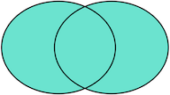

> SQL全称：Structured Query Language
>
> 结构化查询语言

## Sql语句分类

**DDL：Data Definition Language**

DDL允许用户定义数据，也就是创建表、删除表、修改表结构这些操作。通常，DDL由数据库管理员执行。

**DML：Data Manipulation Language**

DML为用户提供添加、删除、更新数据的能力，这些是应用程序对数据库的日常操作。

**DQL：Data Query Language**

DQL允许用户查询数据，这也是通常最频繁的数据库日常操作。

## MySQL引擎

> 相当于浏览器和浏览器引擎

主要有InnoDB和MyISAM，默认选InnoDB

## 关系模型

关系通过**主键**和**外键**来维护

### 主键

选取主键的一个基本原则是：不使用任何业务相关的字段作为主键。

主键可以选择一个也可以选择多个，多个为联合主键（尽量不使用）：

对于联合主键，允许一列有重复，只要不是所有主键列都重复即可

### 外键

***插入外键***

```sql
ALTER TABLE students
ADD CONSTRAINT fk_class_id
FOREIGN KEY (class_id)
REFERENCES classes (id);
```

其中，外键约束的名称`fk_class_id`可以任意，`FOREIGN KEY (class_id)`指定了`class_id`作为外键，`REFERENCES classes (id)`指定了这个外键将关联到`classes`表的`id`列（即`classes`表的主键）。

外键可以保证插入内容有效，但降低性能，一般也通过应用程序来控制唯一性

***删除外键***

```sql
ALTER TABLE students
DROP FOREIGN KEY fk_class_id;
```

注意：删除外键约束并没有删除外键这一列。删除列是通过`DROP COLUMN ...`实现的。

### 索引

创建索引

```sql
LTER TABLE students
ADD INDEX idx_score (score);
```

使用`ADD INDEX idx_score (score)`就创建了一个名称为`idx_score`，使用列`score`的索引。索引名称是任意的，索引如果有多列，可以在括号里依次写上，例如：

```sql
ALTER TABLE students
ADD INDEX idx_name_score (name, score);
```

索引的效率取决于索引列的值是否散列，即该列的值如果越互不相同，那么索引效率越高。反过来，如果记录的列存在大量相同的值，例如`gender`列，大约一半的记录值是`M`，另一半是`F`，因此，对该列创建索引就没有意义。

可以对一张表创建多个索引。索引的优点是提高了查询效率，缺点是在插入、更新和删除记录时，需要同时修改索引，因此，索引越多，插入、更新和删除记录的速度就越慢。

对于主键，关系数据库会自动对其创建主键索引。使用主键索引的效率是最高的，因为主键会保证绝对唯一。

唯一索引：索引且唯一

```sql
ALTER TABLE students
ADD UNIQUE INDEX uni_name (name);
```

通过`UNIQUE`关键字我们就添加了一个唯一索引。

唯一约束：无索引且唯一

```sql
ALTER TABLE students
ADD CONSTRAINT uni_name UNIQUE (name);
```

这种情况下，`name`列没有索引，但仍然具有唯一性保证。

## 查询数据

查询特殊列叫投影查询，自定义别名可以用as也可以不用

排序默认升序`ASC`，降序`DESC`，可对多列进行排序

分页查询：

```sql
SELECT id, name, gender, score
FROM students
ORDER BY score DESC
LIMIT 3 OFFSET 0;
```

多表查询，列数为两表列数之和，行数为两表行数之积

连接查询

注意INNER JOIN查询的写法是：

1. 先确定主表，仍然使用`FROM <表1>`的语法；
2. 再确定需要连接的表，使用`INNER JOIN <表2>`的语法；
3. 然后确定连接条件，使用`ON <条件...>`，这里的条件是`s.class_id = c.id`，表示`students`表的`class_id`列与`classes`表的`id`列相同的行需要连接；
4. 可选：加上`WHERE`子句、`ORDER BY`等子句。

```sql
SELECT s.id, s.name, s.class_id, c.name class_name, s.gender, s.score
FROM students s
INNER JOIN classes c
ON s.class_id = c.id;
```

假设查询语句是：

```
SELECT ... FROM tableA ??? JOIN tableB ON tableA.column1 = tableB.column2;
```

我们把tableA看作左表，把tableB看成右表，那么INNER JOIN是选出两张表都存在的记录：


LEFT OUTER JOIN是选出左表存在的记录：


RIGHT OUTER JOIN是选出右表存在的记录：


FULL OUTER JOIN则是选出左右表都存在的记录：



## 修改数据

### INSERT

`INSERT`语句的基本语法是：

```sql
INSERT INTO <表名> (字段1, 字段2, ...) VALUES (值1, 值2, ...);
```

Mysql 甚至可以一次插入多行，值后,下去

### UPDATE

`UPDATE`语句的基本语法是：

```sql
UPDATE <表名> SET 字段1=值1, 字段2=值2, ... WHERE ...;
```

### DELETE

`DELETE`语句的基本语法是：

```sql
DELETE FROM <表名> WHERE ...;
```

## 管理MySQL

### 数据库

查看当前数据库

```bash
mysql> SHOW DATABASES;
+--------------------+
| Database           |
+--------------------+
| information_schema |
| mysql              |
| performance_schema |
| shici              |
| sys                |
| test               |
| school             |
+--------------------+
```

其中，`information_schema`、`mysql`、`performance_schema`和`sys`是系统库，不要去改动它们。其他的是用户创建的数据库。

要创建一个新数据库，使用命令：

```bash
mysql> CREATE DATABASE test;
Query OK, 1 row affected (0.01 sec)
```

要删除一个数据库，使用命令：

```bash
mysql> DROP DATABASE test;
Query OK, 0 rows affected (0.01 sec)
```

注意：删除一个数据库将导致该数据库的所有表全部被删除。

对一个数据库进行操作时，要首先将其切换为当前数据库：

```bash
mysql> USE test;
Database changed
```

### 表

列出当前数据库的所有表，使用命令：

```bash
mysql> SHOW TABLES;
+---------------------+
| Tables_in_test      |
+---------------------+
| classes             |
| statistics          |
| students            |
| students_of_class1  |
+---------------------+
```

要查看一个表的结构，使用命令：

```bash
mysql> DESC students;
+----------+--------------+------+-----+---------+----------------+
| Field    | Type         | Null | Key | Default | Extra          |
+----------+--------------+------+-----+---------+----------------+
| id       | bigint(20)   | NO   | PRI | NULL    | auto_increment |
| class_id | bigint(20)   | NO   |     | NULL    |                |
| name     | varchar(100) | NO   |     | NULL    |                |
| gender   | varchar(1)   | NO   |     | NULL    |                |
| score    | int(11)      | NO   |     | NULL    |                |
+----------+--------------+------+-----+---------+----------------+
5 rows in set (0.00 sec)
```

还可以使用以下命令查看创建表的SQL语句：

```bash
mysql> SHOW CREATE TABLE students;
+----------+-------------------------------------------------------+
| students | CREATE TABLE `students` (                             |
|          |   `id` bigint(20) NOT NULL AUTO_INCREMENT,            |
|          |   `class_id` bigint(20) NOT NULL,                     |
|          |   `name` varchar(100) NOT NULL,                       |
|          |   `gender` varchar(1) NOT NULL,                       |
|          |   `score` int(11) NOT NULL,                           |
|          |   PRIMARY KEY (`id`)                                  |
|          | ) ENGINE=InnoDB AUTO_INCREMENT=1 DEFAULT CHARSET=utf8 |
+----------+-------------------------------------------------------+
1 row in set (0.00 sec)
```

创建表使用`CREATE TABLE`语句，而删除表使用`DROP TABLE`语句：

```bash
mysql> DROP TABLE students;
Query OK, 0 rows affected (0.01 sec)
```

修改表就比较复杂。如果要给`students`表新增一列`birth`，使用：

```bash
ALTER TABLE students ADD COLUMN birth VARCHAR(10) NOT NULL;
```

要修改`birth`列，例如把列名改为`birthday`，类型改为`VARCHAR(20)`：

```bash
ALTER TABLE students CHANGE COLUMN birth birthday VARCHAR(20) NOT NULL;
```

要删除列，使用：

```bash
ALTER TABLE students DROP COLUMN birthday;
```

## 数据库事务

数据库事务具有ACID这4个特性：

- A：Atomic，原子性，将所有SQL作为原子工作单元执行，要么全部执行，要么全部不执行；
- C：Consistent，一致性，事务完成后，所有数据的状态都是一致的，即A账户只要减去了100，B账户则必定加上了100；
- I：Isolation，隔离性，如果有多个事务并发执行，每个事务作出的修改必须与其他事务隔离；
- D：Duration，持久性，即事务完成后，对数据库数据的修改被持久化存储。

一般我们执行的语句没有`commit`的都是隐式事务，显示事务如下：

```sql
BEGIN;
UPDATE accounts SET balance = balance - 100 WHERE id = 1;
UPDATE accounts SET balance = balance + 100 WHERE id = 2;
COMMIT;
```

### 隔离级别

SQL标准定义了4种隔离级别，分别对应可能出现的数据不一致的情况：

| Isolation Level  | 脏读（Dirty Read） | 不可重复读（Non Repeatable Read） | 幻读（Phantom Read） |
| :--------------- | :----------------- | :-------------------------------- | :------------------- |
| Read Uncommitted | Yes                | Yes                               | Yes                  |
| Read Committed   | -                  | Yes                               | Yes                  |
| Repeatable Read  | -                  | -                                 | Yes                  |
| Serializable     | -                  | -                                 | -                    |

### 默认隔离级别

如果没有指定隔离级别，数据库就会使用默认的隔离级别。在MySQL中，如果使用InnoDB，默认的隔离级别是Repeatable Read。